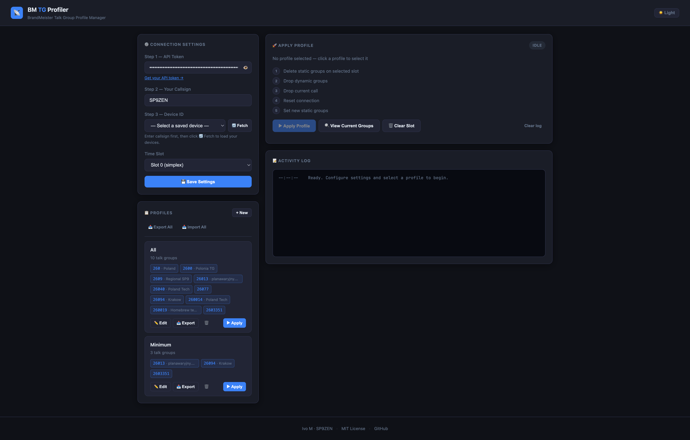

# bm-tg-profiler

Replace all existing BM static and dynamic groups with the new set of static groups.

# Introduction

- **DMR (Digital Mobile Radio):** An open digital radio standard for professional mobile radio communications, enabling efficient voice and data transmission.

- **BrandMeister:** A global network for DMR repeaters and hotspots, providing connectivity, routing, and management of DMR talk groups.

- **Hotspot:** A small device that connects to the internet and acts as a personal DMR gateway, allowing radios to access networks like BrandMeister without a local repeater.

- **Talk Group:** A virtual channel or group ID in DMR systems that allows users to communicate with others sharing the same group, organizing conversations by topic or region.

# Rationale

Managing talk groups on a DMR hotspot — particularly in simplex mode — can be challenging, as switching between groups to avoid interference is not straightforward. Additionally, the BrandMeister user interface is not optimized for efficiently adding or removing talk groups, especially when handling a large number of entries.

This project addresses these limitations by allowing users to define and store "presets" or "profiles" containing lists of talk groups. These profiles can be quickly applied to a specific device, streamlining the process of managing talk group configurations.

During the profile switch process, the script removes all calls and dynamic groups and resets the BrandMeister connection, ensuring that only the newly selected talk groups are active, so you can communicate without interference from previous groups.

## Requirements
- Python 3.8 or higher
- `pip` for dependency management
- BM token (API key) - see [BrandMeister User API keys – BrandMeister DMR News](https://news.brandmeister.network/introducing-user-api-keys/)

## Installation
1. Clone the repository:
   ```bash
   git clone https://github.com/your-username/bm-tg-profiler.git
   cd bm-tg-profiler
   ```

2. Create a virtual environment (optional but recommended):
   ```bash
   python3 -m venv venv
   source venv/bin/activate  # On Windows: venv\Scripts\activate
   ```

3. Install dependencies:
   ```bash
   pip install -r requirements.txt
   ```

## Usage
1. Run the script:
   ```bash
   python bm_profile.py -h
   ```

2. Follow the on-screen instructions to manage static group profiles:
   ```
   usage: bm_profile.py [-h] --device_id DEVICE_ID --token TOKEN [--slot SLOT] --profile_file PROFILE_FILE [--plain-print]

   Manage static groups for BrandMeister.

   options:
   -h, --help            show this help message and exit
   --device_id DEVICE_ID
                           The device ID of the repeater.
   --token TOKEN         The BrandMeister API token.
   --slot SLOT           The time slot to use (default: 0).
   --profile_file PROFILE_FILE
                           Path to the JSON profile file containing static groups.
   --plain-print         Disable colors and emojis in output
   ```

3. Example profile file:
   ```json
   {
    "static_groups": [
       260,
       260014,
       260019,
       26013,
       26077,
       2609,
       26094
    ]
   }
   ```

4. Example run:
   ```bash
   $ venv/bin/python bm_profile.py --token xxx --device_id 123 --profile_file ./example_profile.json
   ℹ️ 📄 Loaded profile with 1 static groups
   ℹ️ 🧹 Deleting 10 static groups.
   ℹ️ 🗑️ Deleted static group 260014 on slot 0.
   ℹ️ 🗑️ Deleted static group 26040 on slot 0.
   ℹ️ 🗑️ Deleted static group 26013 on slot 0.
   ℹ️ 🗑️ Deleted static group 260 on slot 0.
   ℹ️ 🗑️ Deleted static group 260019 on slot 0.
   ℹ️ 🗑️ Deleted static group 2609 on slot 0.
   ℹ️ 🗑️ Deleted static group 2600 on slot 0.
   ℹ️ 🗑️ Deleted static group 26077 on slot 0.
   ℹ️ 🗑️ Deleted static group 26094 on slot 0.
   ℹ️ 🗑️ Deleted static group 2603351 on slot 0.
   ℹ️ ✅ All delete threads completed.
   ℹ️ 🗑️ Successfully dropped all dynamic groups.
   ℹ️ 📞 Successfully dropped the current call.
   ℹ️ 🔄 Successfully reset connection.
   ℹ️ ➕ Added static group 26013 to slot 0.
   ℹ️ ✅ All add threads completed.
   ✨ 🎉 Profile successfully applied!
   ```

---

# Web GUI

A browser-based interface is available at:

**https://ivomod.github.io/bm-tg-profiler/**

No installation required — it runs entirely in your browser and calls the BrandMeister API directly.



## Features

- **Connection Settings** — Enter your Device ID, API token, and time slot. All values are persisted in browser `localStorage` and restored on every visit. Previously used Device IDs are saved in a dropdown for quick selection; individual entries can be removed with the 🗑️ button. Default time slot is **Slot 1**.
- **Profile Manager** — Create and manage multiple named profiles, each containing a list of talk group numbers. Profiles are stored in `localStorage` and survive page reloads.
- **Dark / Light mode** — Toggle between dark and light themes using the button in the top-right corner of the page. The preference is saved in `localStorage` and applied automatically on the next visit.
- **Talk group names** — For each talk group number, the name is automatically fetched from the BrandMeister API (`api.brandmeister.network/v2/talkgroup/{id}`) and displayed alongside the number in profile cards, the edit modal, the current groups panel, and the activity log. Names are cached in `localStorage` for 24 hours to avoid repeated requests.
- **One-click Apply** — Selecting a profile and clicking Apply runs the full 5-step sequence with a live progress tracker and timestamped activity log:
  1. Delete all existing static groups
  2. Drop dynamic groups
  3. Drop current call
  4. Reset connection
  5. Set new static groups
- **View Current Groups** — Inspect which static groups are currently configured on the device without applying any changes.
- **Import / Export (single profile)** — Import talk groups from a JSON profile file (`{"static_groups": [...]}`) by pasting JSON or loading a file from disk. Export any profile back to JSON.
- **Import / Export (all profiles)** — Export all profiles at once to a `bm-profiles.json` file for backup or transfer. Import that file on any device to restore all profiles in one step. Importing all profiles will replace existing ones — a confirmation prompt is shown before overwriting.

## Usage

1. Open **https://ivomod.github.io/bm-tg-profiler/** in your browser.
2. Fill in **Device ID** (or pick a previously used one from the dropdown), **API Token**, and **Time Slot** in the Connection Settings panel. Click **Save Settings** — the Device ID is added to the saved list automatically.
3. Create a profile by clicking **+ New** in the Profiles panel and adding talk group numbers.
4. Click **▶ Apply** next to a profile (or select it and click **Apply Profile**) to push it to your device.

> **Note:** Your API token is stored only in your own browser's `localStorage` and is never sent anywhere except directly to the BrandMeister API (`api.brandmeister.network`).

---

## Tests
Run the test suite with:
```bash
python3 -m pytest -v
```

## License
This project is licensed under the MIT License. See the `LICENSE` file for details.
